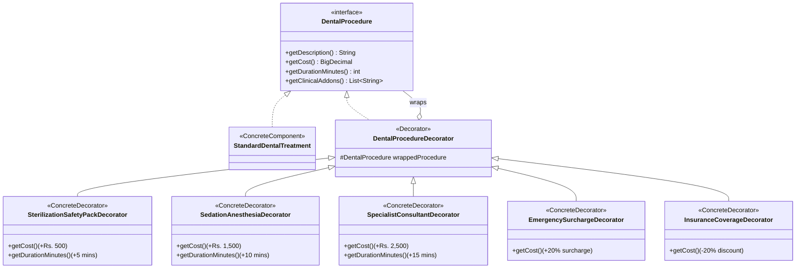

# SUNRISE DENTAL CLINIC MANAGEMENT SYSTEM
## COMPREHENSIVE DESIGN PATTERNS & ARCHITECTURAL SPECIFICATION

This document provides a comprehensive academic and industrial specification of all software engineering design patterns and architectural patterns implemented in the **Sunrise Dental Clinic Management System**.

---

## Master Summary of Implemented Design Patterns

| # | Design Pattern | Category (GoF / JEE) | Implementation Files | Location & Role in System |
|---|----------------|----------------------|----------------------|----------------------------|
| **1** | **Singleton Pattern** | Creational (GoF) | `DBConnection.java` | Centralized database connection pool management across the entire application lifecycle. |
| **2** | **Builder Pattern** | Creational (GoF) | `AppointmentBuilder.java`<br/>`BillBuilder.java`<br/>`Appointment.java`<br/>`Bill.java` | Fluent step-by-step construction of complex multi-property entities (`Appointment` and `Bill`) with default enforcement and automated financial calculation. |
| **3** | **Factory Method / Factory Pattern** | Creational (GoF) | `DAOFactory.java`<br/>`PaymentStrategyFactory.java` | Decoupled instantiation of DAOs and runtime creation of payment processing strategies. |
| **4** | **Decorator Pattern** | Structural (GoF) | `DentalProcedure.java`<br/>`StandardDentalTreatment.java`<br/>`DentalProcedureDecorator.java`<br/>`SterilizationSafetyPackDecorator.java`<br/>`SedationAnesthesiaDecorator.java`<br/>`SpecialistConsultantDecorator.java`<br/>`EmergencySurchargeDecorator.java`<br/>`InsuranceCoverageDecorator.java` | Dynamic runtime attachment of clinical enhancements (PPE sterilization packs, sedation, specialist review, emergency surcharges) to core treatments. |
| **5** | **Strategy Pattern** | Behavioral (GoF) | `PaymentStrategy.java`<br/>`CashPaymentStrategy`<br/>`CardPaymentStrategy`<br/>`BankTransferPaymentStrategy`<br/>`OnlinePaymentStrategy` | Encapsulates payment validation and processing algorithms interchangeably according to payment method. |
| **6** | **Data Access Object (DAO) Pattern** | Architectural (JEE) | `PatientDAO.java` & `impl`<br/>`AppointmentDAO.java` & `impl`<br/>`BillDAO.java` & `impl`<br/>`PaymentDAO.java` & `impl`<br/>`DentistDAO.java` & `impl`<br/>`TreatmentDAO.java` & `impl`<br/>`PrescriptionDAO.java` & `impl`<br/>`UserDAO.java` & `impl` | Completely decouples domain logic from SQL/JDBC database queries and connection handling. |
| **7** | **Intercepting Filter Pattern** | Architectural (JEE) | `AuthenticationFilter.java`<br/>`AuthorizationFilter.java` | Pre-processing security pipeline enforcing user session validity, role-based access control (RBAC), and public QR code whitelisting. |
| **8** | **Model-View-Controller (MVC) Pattern** | Architectural (GoF / JEE) | Models (`com.sunrise.dental.model`)<br/>Views (`WebContent/**/*.jsp`)<br/>Controllers (`com.sunrise.dental.controller`) | Strict 3-tier separation of concerns between presentation, HTTP dispatching, and business state. |

---

## 1. Singleton Design Pattern (Creational)

### 1.1 Intent & Motivation
Database connections are expensive system resources. Creating a new physical database connection on every request causes performance degradation, connection pool exhaustion, and memory leaks. The **Singleton Pattern** guarantees that only one instance of the database manager exists, providing a synchronized, global access point.

### 1.2 Implementation Details
* **File:** [`DBConnection.java`](file:///c:/Users/hp/Desktop/AP/SunriseDental/src/com/sunrise/dental/util/DBConnection.java)
* **Technique:** Thread-safe Double-Checked Locking (or synchronized getInstance) with private constructor preventing reflection/external instantiation.

```java
public class DBConnection {
    private static volatile DBConnection instance;
    private final DataSource dataSource;

    private DBConnection() {
        // Private constructor prevents external 'new' instantiations
        this.dataSource = initConnectionPool();
    }

    public static DBConnection getInstance() {
        if (instance == null) {
            synchronized (DBConnection.class) {
                if (instance == null) {
                    instance = new DBConnection();
                }
            }
        }
        return instance;
    }

    public static Connection getConnection() throws SQLException {
        return getInstance().dataSource.getConnection();
    }
}
```

### 1.3 Where It Is Used
- In every DAO implementation (`PatientDAOImpl`, `AppointmentDAOImpl`, `BillDAOImpl`, etc.) to obtain standard JDBC connections via try-with-resources:
  ```java
  try (Connection conn = DBConnection.getConnection();
       PreparedStatement ps = conn.prepareStatement(sql)) { ... }
  ```

---

## 2. Builder Design Pattern (Creational)

### 2.1 Intent & Motivation
Domain entities like `Appointment` and `Bill` contain 15–20 fields (IDs, dates, times, foreign keys, priorities, address/phone contact synchronizations, and multi-tier monetary figures). 
- Using telescoping constructors leads to unreadable, bug-prone code (e.g. confusing 5 consecutive string or integer arguments).
- Using scattered setters risks partial or unvalidated object initialization.
The **Builder Pattern** separates the construction of complex objects from their representation, providing a readable, method-chained (fluent) API with default value enforcement.

### 2.2 Implementation Details
* **Classes:**
  - [`AppointmentBuilder.java`](file:///c:/Users/hp/Desktop/AP/SunriseDental/src/com/sunrise/dental/builder/AppointmentBuilder.java) &mdash; builder for appointments.
  - [`BillBuilder.java`](file:///c:/Users/hp/Desktop/AP/SunriseDental/src/com/sunrise/dental/builder/BillBuilder.java) &mdash; builder for invoices with automated math.
  - Static factory hooks: `Appointment.builder()` and `Bill.builder()`.

```java
// Fluent Appointment Construction in AppointmentServlet
Appointment appt = Appointment.builder()
        .patientId(patientId)
        .dentistId(dentistId)
        .treatmentId(treatmentId)
        .appointmentDate(date)
        .appointmentTime(time)
        .priority(priorityParam) // Automatically normalized to NORMAL/URGENT/EMERGENCY
        .patientPhone(phone)
        .patientAddress(address)
        .notes(notes)
        .build();
```

```java
// Fluent Financial Bill Construction in BillingService
Bill bill = Bill.builder()
        .billNumber(billDAO.generateBillNumber())
        .appointmentId(appointmentId)
        .patientId(patientId)
        .consultationFee(consultFee)
        .treatmentCost(treatmentCost)
        .additionalCharges(additionalCharges, desc)
        .discount(discountPercent, discountAmt)
        .tax(taxPercent, taxAmt)
        .totals(subTotal, grandTotal)
        .status("ISSUED")
        .dates(LocalDate.now(), LocalDate.now())
        .createdBy(userId)
        .build();
```

### 2.3 Where It Is Used
- **[`AppointmentServlet.java`](file:///c:/Users/hp/Desktop/AP/SunriseDental/src/com/sunrise/dental/controller/AppointmentServlet.java#L231)**: Constructing incoming form appointments.
- **[`BillingService.java`](file:///c:/Users/hp/Desktop/AP/SunriseDental/src/com/sunrise/dental/service/BillingService.java#L107)**: Creating official patient bills.
- **[`BuilderPatternTest.java`](file:///c:/Users/hp/Desktop/AP/SunriseDental/test/com/sunrise/dental/BuilderPatternTest.java)**: Automated unit verification.

---

## 3. Factory Method & Abstract Factory Pattern (Creational)

### 3.1 Intent & Motivation
Decouples client code from concrete implementations. When client components need a data access object or payment strategy, they do not instantiate the concrete class directly using `new PatientDAOImpl()`. Instead, they ask a Factory. This facilitates dependency inversion and seamless mocking for automated unit tests.

### 3.2 Implementation Details
1. **[`DAOFactory.java`](file:///c:/Users/hp/Desktop/AP/SunriseDental/src/com/sunrise/dental/dao/DAOFactory.java)**:
   - Central creator for all data access objects.
   - Methods: `getPatientDAO()`, `getAppointmentDAO()`, `getBillDAO()`, `getPaymentDAO()`, `getDentistDAO()`, `getTreatmentDAO()`, `getUserDAO()`.
2. **[`PaymentStrategyFactory.java`](file:///c:/Users/hp/Desktop/AP/SunriseDental/src/com/sunrise/dental/service/PaymentStrategyFactory.java)**:
   - Evaluates payment method strings (`"CASH"`, `"CARD"`, `"BANK_TRANSFER"`, `"ONLINE"`) and produces the appropriate concrete `PaymentStrategy`.

```java
// PaymentStrategyFactory implementation
public static PaymentStrategy getStrategy(String method) throws ApplicationException {
    if (method == null) throw new ApplicationException("Payment method is required.");
    return switch (method.toUpperCase()) {
        case "CASH"          -> new CashPaymentStrategy();
        case "CARD"          -> new CardPaymentStrategy();
        case "BANK_TRANSFER" -> new BankTransferPaymentStrategy();
        case "ONLINE"        -> new OnlinePaymentStrategy();
        case "CHEQUE"        -> new BankTransferPaymentStrategy();
        default -> throw new ApplicationException("Unsupported payment method: " + method);
    };
}
```

### 3.3 Where It Is Used
- Across all Service classes (`AppointmentService`, `BillingService`, `AuthService`, `PatientService`).
- In `PaymentService` to dynamically obtain the validation strategy during checkout.

---

## 4. Decorator Design Pattern (Structural)

### 4.1 Intent & Motivation
Clinical dental procedures often involve dynamic add-ons, supplemental materials, and urgent surcharges (e.g. PPE sterilization packs, twilight sedation, specialist consultation, or after-hours surcharges). Creating subclasses for every conceivable combination (e.g., `SedatedSterilizedEmergencyRootCanal`) leads to a combinatorial **class explosion**. 

The **Decorator Pattern** allows enhancements, chair times, and costs to be stacked dynamically on top of a core treatment at runtime without modifying existing classes, fully adhering to the **Open/Closed Principle (OCP)**.

### 4.2 Implementation Details
Located in `com.sunrise.dental.decorator`:



### 4.3 Where It Is Used
- **[`BillingService.java`](file:///c:/Users/hp/Desktop/AP/SunriseDental/src/com/sunrise/dental/service/BillingService.java#L225)**: In method `calculateCustomProcedureQuote()`, allowing dynamic generation of customized clinical treatment estimates.
- **[`DecoratorPatternTest.java`](file:///c:/Users/hp/Desktop/AP/SunriseDental/test/com/sunrise/dental/DecoratorPatternTest.java)**: Automated unit testing of chained procedure calculation.

---

## 5. Strategy Design Pattern (Behavioral)

### 5.1 Intent & Motivation
The clinic supports diverse payment options: Cash, Credit/Debit Card, Bank Transfer, Online Gateway, and Cheque. Each method requires distinct validation rules:
- **Cash**: Requires no reference; amount must be positive.
- **Card**: Requires valid merchant authorization/approval code (min 4 chars).
- **Bank Transfer**: Requires transaction slip / electronic reference code.
- **Online Gateway**: Requires gateway transaction ID.

Hardcoding `if-else` or `switch` blocks throughout billing services violates the Single Responsibility Principle. The **Strategy Pattern** encapsulates each payment validation algorithm into its own dedicated class implementing a common interface.

### 5.2 Implementation Details
* **Strategy Interface:** [`PaymentStrategy.java`](file:///c:/Users/hp/Desktop/AP/SunriseDental/src/com/sunrise/dental/service/PaymentStrategy.java)
* **Concrete Strategies:**
  - `CashPaymentStrategy`
  - `CardPaymentStrategy`
  - `BankTransferPaymentStrategy`
  - `OnlinePaymentStrategy`

```java
public interface PaymentStrategy {
    void validate(String transactionRef, BigDecimal amount) throws ApplicationException;
    String getMethodName();
}
```

### 5.3 Where It Is Used
- In `BillingService.processPayment()` / `PaymentServlet.java` to validate payments dynamically before saving to the database.

---

## 6. Data Access Object (DAO) Pattern (Architectural)

### 6.1 Intent & Motivation
Prevents business logic from becoming tightly coupled to database technologies and SQL dialect. If the database schema changes, only the DAO implementation is modified; servlets, controllers, and services remain completely unaffected.

### 6.2 Implementation Details
- **Interfaces (`com.sunrise.dental.dao`)**: `PatientDAO`, `AppointmentDAO`, `BillDAO`, `PaymentDAO`, `DentistDAO`, `TreatmentDAO`, `PrescriptionDAO`, `UserDAO`.
- **Implementations (`com.sunrise.dental.dao.impl`)**: `PatientDAOImpl`, `AppointmentDAOImpl`, etc.
- **Key JDBC Security Rules**:
  1. 100% `PreparedStatement` parameter binding (no SQL injection vulnerabilities).
  2. Automatic resource management via `try-with-resources`.
  3. Safe wildcard binding for multi-criteria search.

---

## 7. Intercepting Filter Pattern (Architectural)

### 7.1 Intent & Motivation
Provides a centralized, declarative mechanism to intercept incoming HTTP requests and outgoing responses before they reach controllers. This prevents duplicating authentication and authorization checks across individual servlets.

### 7.2 Implementation Details
1. **[`AuthenticationFilter.java`](file:///c:/Users/hp/Desktop/AP/SunriseDental/src/com/sunrise/dental/filter/AuthenticationFilter.java)**:
   - Validates that the user has an active session (`session.getAttribute("user") != null`).
   - Whitelists public paths (`/login.jsp`, `/LoginServlet`, `/verify-bill`, `/css/`, `/js/`, `/images/`).
   - Enables public QR code invoice verification on mobile phones without login interference.
2. **[`AuthorizationFilter.java`](file:///c:/Users/hp/Desktop/AP/SunriseDental/src/com/sunrise/dental/filter/AuthorizationFilter.java)**:
   - Enforces Role-Based Access Control (RBAC):
     - `ADMINISTRATOR`: Full system access.
     - `DENTIST`: Clinical records, prescriptions, dentist dashboard.
     - `RECEPTIONIST`: Appointments, patient registration, billing, payments.

---

## 8. Model-View-Controller (MVC) Pattern (Architectural)

### 8.1 Intent & Motivation
Enforces strict 3-tier separation of concerns across presentation, routing/control, and domain state.

- **Model (POJOs & Entities)**: `com.sunrise.dental.model` (`Patient`, `Appointment`, `Bill`, `Treatment`, `User`). Represents the data state and business rules.
- **View (JavaServer Pages)**: `WebContent/**/*.jsp` (`dashboard.jsp`, `bill-view.jsp`, `receipt.jsp`, `verify-bill.jsp`). Renders presentation using HTML5, CSS3, and JSTL tags without embedded database calls.
- **Controller (Jakarta Servlets)**: `com.sunrise.dental.controller` (`LoginServlet`, `AppointmentServlet`, `BillingServlet`, `VerifyBillServlet`). Handles HTTP GET/POST, validates parameters, coordinates services, and selects appropriate views.

---

## SOLID Principles Mapping Table

| Principle | Meaning | How Sunrise Dental Applies It |
|---|---|---|
| **S - Single Responsibility Principle (SRP)** | A class should have one and only one reason to change. | DAOs only handle SQL; Services only handle business logic; Servlets only handle HTTP routing; Strategies only validate specific payment methods. |
| **O - Open/Closed Principle (OCP)** | Open for extension, closed for modification. | New clinical add-ons can be added using the **Decorator Pattern** without editing `StandardDentalTreatment`. New payment methods can be added using the **Strategy Pattern** without modifying `BillingService`. |
| **L - Liskov Substitution Principle (LSP)** | Subtypes must be substitutable for their base types. | Any `DentalProcedureDecorator` can be used wherever a `DentalProcedure` is expected. Any `PaymentStrategy` can be passed to the payment executor. |
| **I - Interface Segregation Principle (ISP)** | Clients should not be forced to depend on methods they do not use. | Fine-grained interfaces (`PatientDAO`, `BillDAO`, `PaymentStrategy`, `DentalProcedure`) rather than monolithic interfaces. |
| **D - Dependency Inversion Principle (DIP)** | High-level modules should depend on abstractions, not concrete classes. | Services depend on DAO interfaces (via `DAOFactory`), not on concrete `*DAOImpl` classes. |

---

## Verification & Automated Test Coverage

The system's design patterns are verified through **29 automated JUnit tests** in `SunriseDentalTestSuite.java`:
- **Builder Pattern**: Verified in [`BuilderPatternTest.java`](file:///c:/Users/hp/Desktop/AP/SunriseDental/test/com/sunrise/dental/BuilderPatternTest.java).
- **Decorator Pattern**: Verified in [`DecoratorPatternTest.java`](file:///c:/Users/hp/Desktop/AP/SunriseDental/test/com/sunrise/dental/DecoratorPatternTest.java).
- **Strategy & Factory Patterns**: Verified in `BillingServiceTest.java` and `PaymentServiceTest.java`.
- **DAO & Service Layers**: Verified in `AppointmentServiceTest.java`, `PatientServiceTest.java`, `AuthServiceTest.java`.
